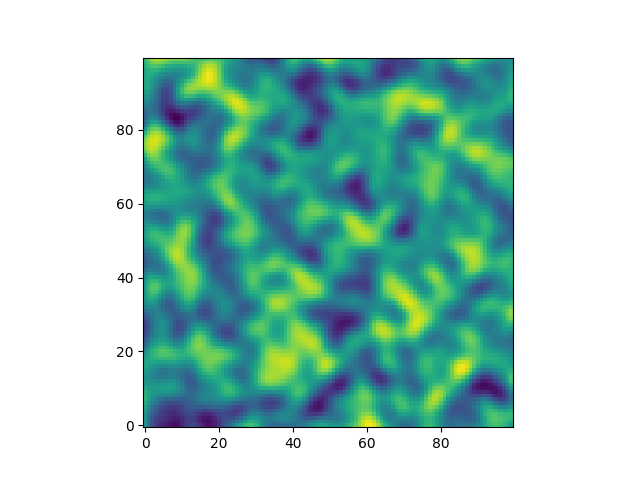
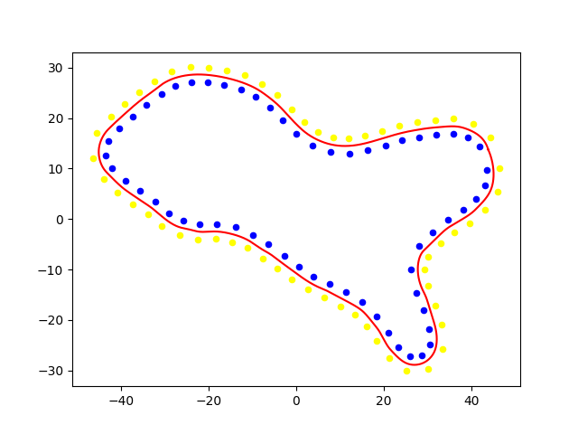

# MirenaTrack
A racetrack Generation algorith based on level curves from 2D simplex noise.

## Method
It generates a OpenSimplex 2D Noise map and uses the Marching Squares algorithm to get the level curves at a given height, discards the smaller ones, interpolates them with a parametric spline, scales them to the map
size and generates the cone gates around them. The cones are then exported in a json format.
Noise Map                  | Generated Track
:-------------------------:|:-------------------------:
   | 
